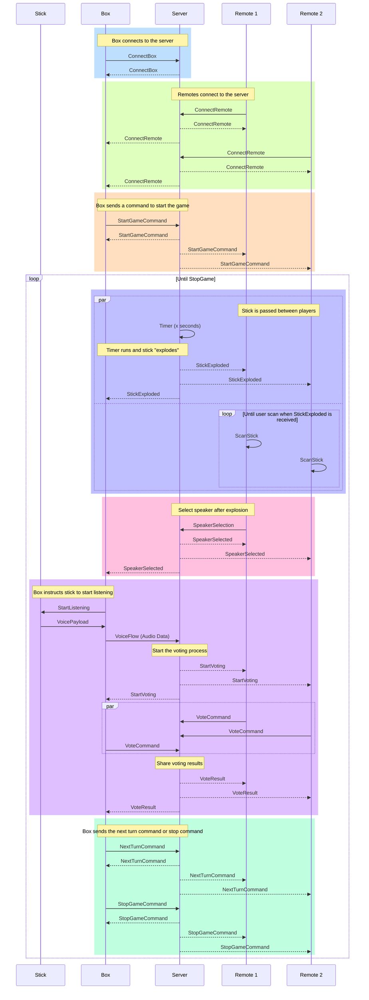

# Anecdot

## Table of Contents

- [Anecdot](#anecdot)
  - [Table of Contents](#table-of-contents)
  - [Introduction](#introduction)
  - [Gameplay](#gameplay)
  - [Project structure](#project-structure)
  - [Setup](#setup)
  - [Sequence diagram](#sequence-diagram)

## Introduction

Anecdot is a multiplayer game where players take turns telling anecdotes about a particular theme. The game is played with a box that serves as a central hub and remote devices that players use to interact with the game.

## Gameplay

To play the game, players need to:

1. Connect the box to internet by connecting to the hotspot
2. Connect their remote device to the box by using the app
3. Long press the start button on the box to start the game
4. Pass the stick to each other and tap the stick to their phone to validate their turn
5. The player that has the stick when the timer runs out must tell an anecdote about the theme
6. Everyone must submit their vote to tell if the anecdote is true or false
7. Then the box will announce the scores
8. The players can either push the next turn button to continue the game or the stop button to end the game

## Project structure

The project is structured as follows:

- box : The arduino code that runs on the box.
- hotspot : The bash script that setup a hotspot on the box.
- microphone : The arduino code that is used to record audio from the stick.
- mobile-app : The flutter mobile app that players use to interact with the game.
- python-client : Python client that tests the server.
- server : The scala server using akka to manage the game.
- stick : The arduino code that runs on the stick.

## Setup

To set up the game, you need to:

1. Clone the repository
2. Compile the project
3. Run the server
4. Connect the box to the server
5. Connect the remotes to the box

## Sequence diagram

